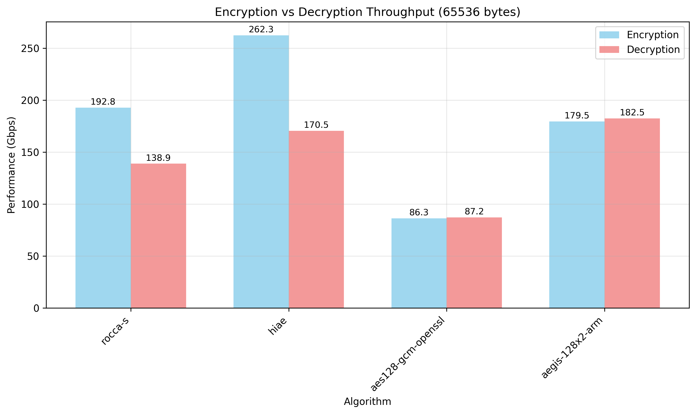
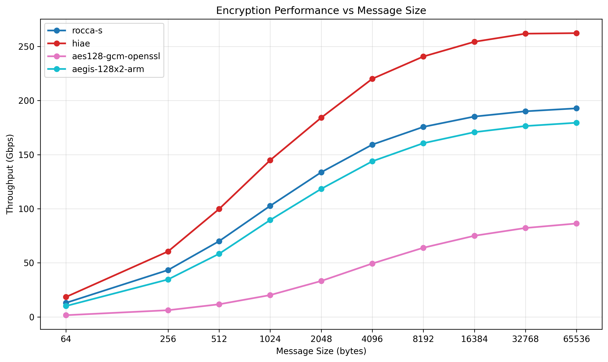
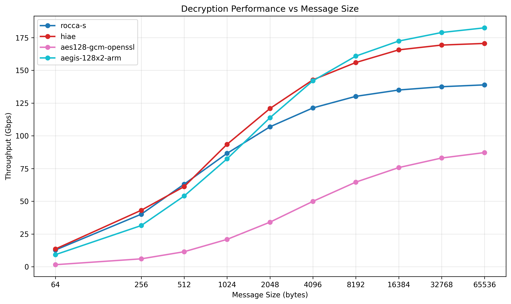
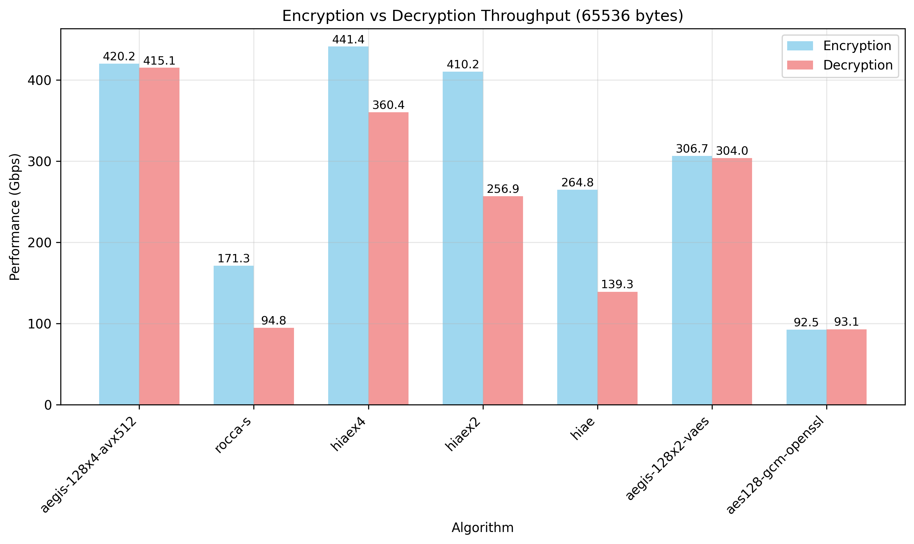
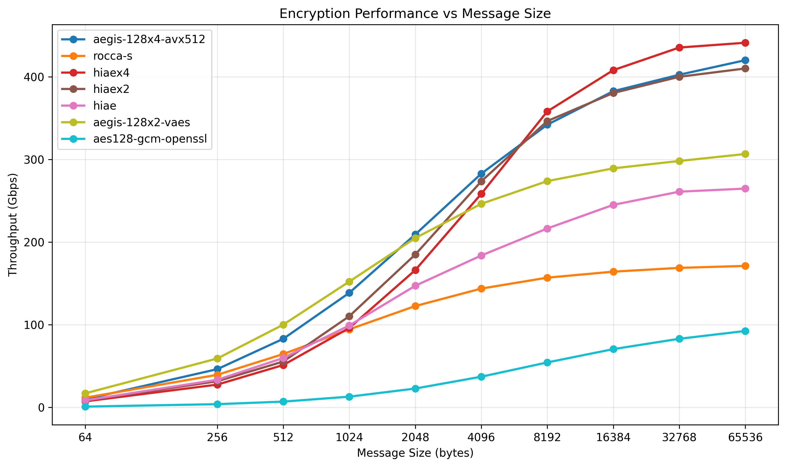
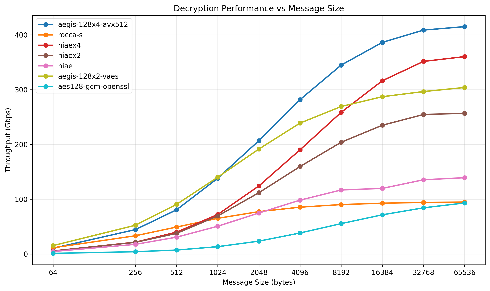

# High-Performance AEADs Benchmarks

This repository contains cryptographic benchmarking implementations for various AEAD (Authenticated Encryption with Associated Data) algorithms designed for high-performance, both on ARM and Intel CPUs.

## Included Algorithms

- **AEGIS-128x2** variants (AES-NI, VAES, ARM)
- **AEGIS-128x4** (AVX-512 optimized)
- **AES-128-GCM** (OpenSSL backend)
- **HiAE** variants (HiAE, HiAEx2, HiAEx4)
- **ROCCA-S** cipher

## Quick Start

### Using the Top-Level Makefile

```bash
# Build all algorithms (auto-detects architecture)
make all

# Build with optimal performance (recommended)
CC="clang -march=native" make all

# Run all tests
make test

# Run all benchmarks
make benchmark

# Clean all build artifacts
make clean
```

### Building Individual Algorithms

Each algorithm is in its own directory with consistent build system:

```bash
cd <algorithm-directory>
make                    # Build test and benchmark executables
./<algorithm>_test      # Run functionality tests
./<algorithm>_benchmark # Run performance benchmarks
```

**Performance Recommendation:** For optimal performance, use `clang` as your compiler:

```bash
CC="clang -march=native" make
```

Clang typically produces faster cryptographic code than GCC due to better optimization of vectorized operations and loop unrolling.

## Architecture Support

The build system automatically detects your architecture and builds appropriate implementations:

- **x86_64/Intel**: AEGIS-128x2 (AES-NI, VAES), AEGIS-128x4 (AVX-512), AES-128-GCM, HiAE, HiAEx2, HiAEx4, ROCCA-S
- **ARM64**: AEGIS-128x2 (ARM crypto extensions), AES-128-GCM, HiAE, HiAEx2, HiAEx4, ROCCA-S

Note: Some implementations require specific CPU features:

- AEGIS-128x2-aesni: AES-NI, AVX
- AEGIS-128x2-vaes: AES-NI, AVX2, VAES
- AEGIS-128x4-avx512: AVX-512F, VAES
- AES-128-GCM: OpenSSL library

## Performance Testing

Benchmarks test multiple message sizes (16B to 64KB) and measure:

- Throughput (Gbps/Mbps)
- Cycles per byte
- Cross-platform performance characteristics

### Running Benchmarks

```bash
# Run all benchmarks
make benchmark

# Run individual benchmark
cd <algorithm-directory>
./<algorithm>_benchmark

# Generate CSV output for analysis
./<algorithm>_benchmark > results.csv
```

## Performance Results

### Apple Silicon M4

<p align="center">
  
</p>

<p align="center">
  
</p>

<p align="center">
  
</p>

### AMD Zen 4

<p align="center">
  
</p>

<p align="center">
  
</p>

<p align="center">
  
</p>

## Benchmark Visualization

The repository includes a Python tool for visualizing benchmark results:

```bash
cd benchmark-visualizer
pip install pandas matplotlib numpy  # or: uv sync
python plot_performance.py path/to/csv/files/
```

This generates comparative plots for:

- Throughput comparison across algorithms
- Efficiency (cycles per byte) analysis
- Performance trends across message sizes

## Dependencies

- C compiler (clang recommended for performance)
- OpenSSL development libraries (for AES-GCM)
- Python 3.x with pandas, matplotlib, numpy (for visualization tools)

## Contributing

When adding new algorithms, follow the existing directory structure and implement the standard AEAD interface defined in `crypto_aead.h`.
