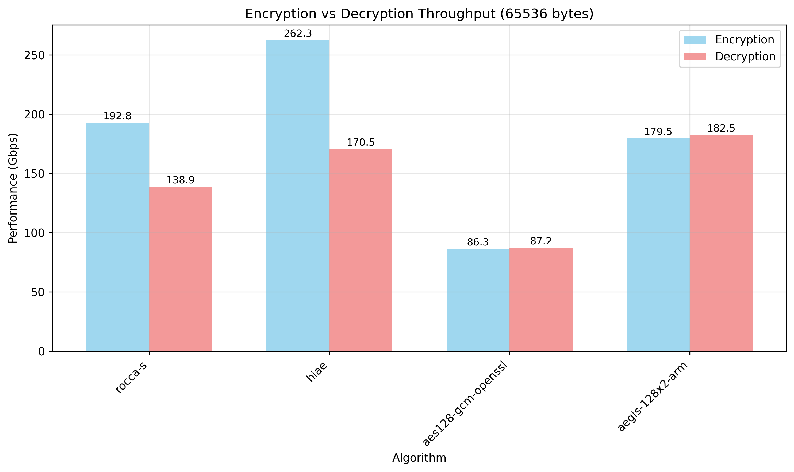
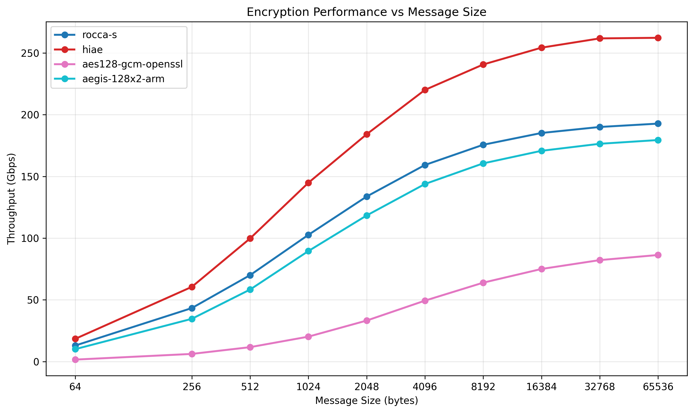
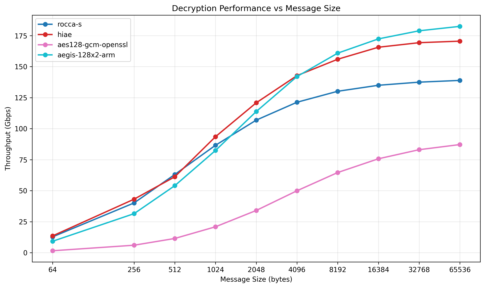
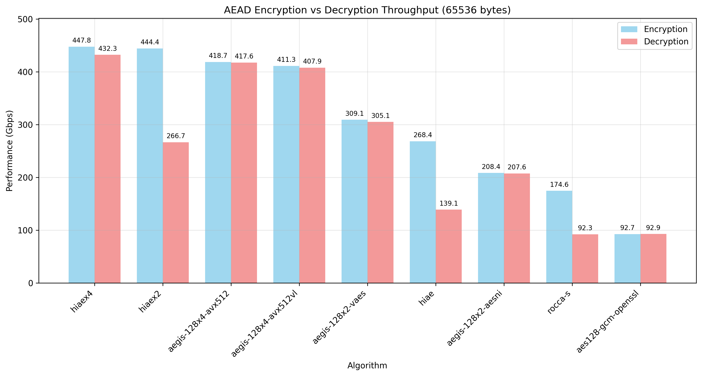
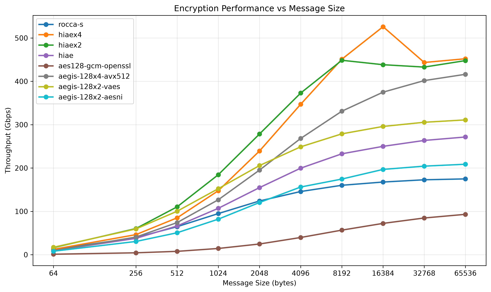
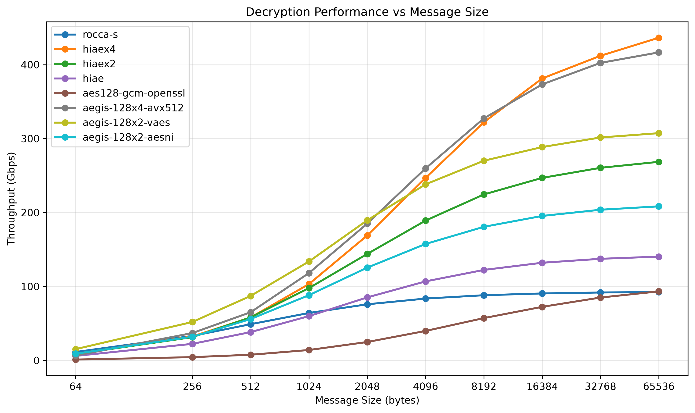

# High-Performance AEADs Benchmarks

This repository contains cryptographic benchmarking implementations for various AEAD (Authenticated Encryption with Associated Data) algorithms designed for high-performance, both on ARM and Intel CPUs.

## Included Algorithms

- **AEGIS-128x2** variants (AES-NI, VAES, ARM)
- **AEGIS-128x4** variants (AVX-512, AVX-512VL)
- **AES-128-GCM** (OpenSSL backend)
- **HiAE** variants (HiAE, HiAEx2, HiAEx4)
- **ROCCA-S** cipher

## Quick Start

### Using the Top-Level Makefile

```bash
# Build all algorithms (auto-detects architecture)
make all

# Build with a specific compiler (clang is used by default when it's installed)
CC=gcc make all

# Run all tests
make test

# Run all benchmarks
make benchmark

# Clean all build artifacts
make clean
```

### Building Individual Algorithms

Each algorithm is in its own directory with consistent build system:

```bash
cd <algorithm-directory>
make                    # Build test and benchmark executables
./<algorithm>_test      # Run functionality tests
./<algorithm>_benchmark # Run performance benchmarks
```

Everything is compiled with `-O3 -march=native` (`-mcpu=native` on ARM) and with clang when it's available, because it usually produces faster code than GCC for these implementations. Use `CC=gcc make` to build with GCC instead.

The HiAE, HiAEx2 and HiAEx4 directories contain a copy of the [libhiae](https://github.com/hiae-aead/libhiae) sources, and their `_test` programs check the output against the libhiae test vectors.

## Architecture Support

The build system automatically detects your architecture and builds appropriate implementations:

- **x86_64/Intel**: AEGIS-128x2 (AES-NI, VAES), AEGIS-128x4 (AVX-512, AVX-512VL), AES-128-GCM, HiAE, HiAEx2, HiAEx4, ROCCA-S
- **ARM64**: AEGIS-128x2 (ARM crypto extensions), AES-128-GCM, HiAE, HiAEx2, HiAEx4, ROCCA-S

Note: Some implementations require specific CPU features:

- AEGIS-128x2-aesni: AES-NI, AVX
- AEGIS-128x2-vaes: AES-NI, AVX2, VAES
- AEGIS-128x4-avx512: AVX-512F, VAES
- AEGIS-128x4-avx512vl: AVX-512F, AVX-512VL, VAES
- AES-128-GCM: OpenSSL library
- HiAEx4 on x86_64: AVX-512F, AVX-512VL and VAES, otherwise it falls back to a much slower portable implementation

The AEGIS-128x4 implementations include the optimizations from libaegis commit `7cc9284`.

The `avx512` variant uses 512-bit vectors, while `avx512vl` splits each state block into two 256-bit vectors and uses AVX-512VL instructions and registers.
This gives CPUs that execute 512-bit AES operations in two passes more freedom to schedule the work.

Both variants are built and benchmarked separately so their performance can be compared on the same CPU.
Their tests check libaegis vectors, block boundaries, in-place operation, and authentication failures.

## Performance Testing

Benchmarks test multiple message sizes (16B to 64KB) and measure:

- Throughput (Gbps/Mbps)
- Cycles per byte
- Cross-platform performance characteristics

The encryption-only measurements generate the keystream obtained by encrypting zeros, then XOR it with the input.
The input never feeds back into the cipher state, and decryption uses the same XOR operation.

These measurements include key and nonce setup but no associated data, tag generation, or tag verification.

AES uses OpenSSL's AES-128-CTR for this mode, with the same initial counter as the GCM message encryption.

The AEAD measurements include associated data and authentication.

Message, ciphertext, plaintext output, and associated-data buffers are aligned to 4096 bytes so their placement stays consistent between runs.

Benchmark keys and nonces, along with local cipher states and scratch buffers, are aligned to at least 64 bytes, including the AVX-512 implementations.

The plots below predate the keystream-XOR benchmark paths and need fresh measurements before comparing encryption-only performance.

### Running Benchmarks

```bash
# Run all benchmarks
make benchmark

# Run individual benchmark
cd <algorithm-directory>
./<algorithm>_benchmark

# Generate CSV output for analysis
./<algorithm>_benchmark > results.csv
```

## Performance Results

### Apple Silicon M4

<p align="center">
  
</p>

<p align="center">
  
</p>

<p align="center">
  
</p>

### AMD Zen 4 (Ryzen 7 7700, clang 21)

<p align="center">
  
</p>

<p align="center">
  
</p>

<p align="center">
  
</p>

## Benchmark Visualization

The repository includes a Python tool for visualizing benchmark results:

```bash
cd benchmark-visualizer
pip install pandas matplotlib numpy  # or: uv sync
python plot_performance.py path/to/csv/files/
```

This generates comparative plots for:

- Throughput comparison across algorithms
- Efficiency (cycles per byte) analysis
- Performance trends across message sizes

## Dependencies

- C compiler (clang recommended for performance)
- OpenSSL development libraries (for AES-GCM)
- Python 3.x with pandas, matplotlib, numpy (for visualization tools)

## Contributing

When adding new algorithms, follow the existing directory structure and implement the standard AEAD interface defined in `crypto_aead.h`.
