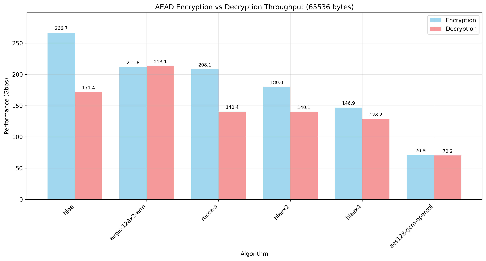
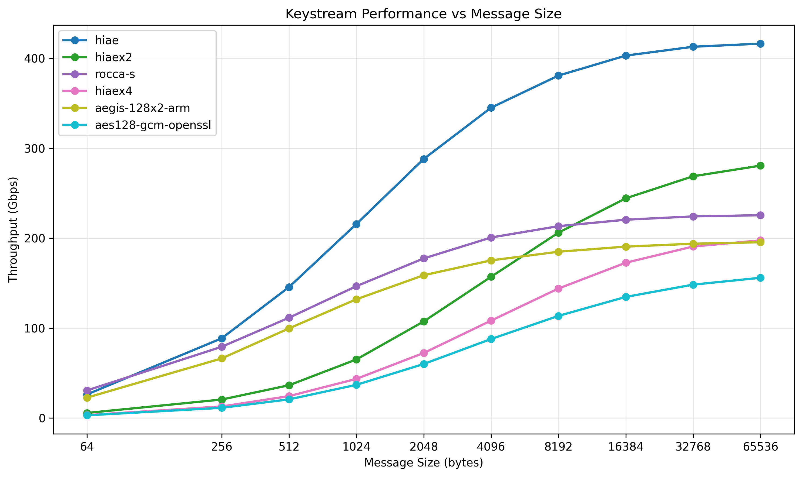

# High-Performance AEADs Benchmarks

This repository contains cryptographic benchmarking implementations for various AEAD (Authenticated Encryption with Associated Data) algorithms designed for high-performance, both on ARM and Intel CPUs.

## Included Algorithms

- **AEGIS-128x2** variants (AES-NI, VAES, ARM)
- **AEGIS-128x4** (AVX-512, VAES)
- **AES-128-GCM** (OpenSSL backend)
- **HiAE** variants (HiAE, HiAEx2, HiAEx4)
- **ROCCA-S** cipher

## Quick Start

### Using the Top-Level Makefile

```bash
# Build all algorithms (auto-detects architecture)
make all

# Build with a specific compiler (clang is used by default when it's installed)
CC=gcc make all

# Run all tests
make test

# Run all benchmarks
make benchmark

# Clean all build artifacts
make clean
```

### Building Individual Algorithms

Each algorithm is in its own directory with consistent build system:

```bash
cd <algorithm-directory>
make                    # Build test and benchmark executables
./<algorithm>_test      # Run functionality tests
./<algorithm>_benchmark # Run performance benchmarks
```

Everything is compiled with `-O3 -march=native` (`-mcpu=native` on ARM) and with clang when it's available, because it usually produces faster code than GCC for these implementations. Use `CC=gcc make` to build with GCC instead.

The HiAE, HiAEx2 and HiAEx4 directories contain a copy of the [libhiae](https://github.com/hiae-aead/libhiae) sources, and their `_test` programs check the output against the libhiae test vectors.

## Architecture Support

The build system automatically detects your architecture and builds appropriate implementations:

- **x86_64/Intel**: AEGIS-128x2 (AES-NI, VAES), AEGIS-128x4 (AVX-512), AES-128-GCM, HiAE, HiAEx2, HiAEx4, ROCCA-S
- **ARM64**: AEGIS-128x2 (ARM crypto extensions), AES-128-GCM, HiAE, HiAEx2, HiAEx4, ROCCA-S

Note: Some implementations require specific CPU features:

- AEGIS-128x2-aesni: AES-NI, AVX
- AEGIS-128x2-vaes: AES-NI, AVX2, VAES
- AEGIS-128x4-avx512: AVX-512F, VAES
- AES-128-GCM: OpenSSL library
- HiAEx4 on x86_64: AVX-512F, AVX-512VL and VAES, otherwise it falls back to a much slower portable implementation

The AEGIS-128x4 implementation includes the optimizations from libaegis commit `7cc9284`.
Its tests check libaegis vectors, block boundaries, in-place operation, and authentication failures.

## Performance Testing

Benchmarks test multiple message sizes (16B to 64KB) and measure:

- Throughput (Gbps/Mbps)
- Cycles per byte
- Cross-platform performance characteristics

The encryption-only measurements generate the keystream obtained by encrypting zeros, then XOR it with the input.
The input never feeds back into the cipher state, and decryption uses the same XOR operation.

These measurements include key and nonce setup but no associated data, tag generation, or tag verification.

AES uses OpenSSL's AES-128-CTR for this mode, with the same initial counter as the GCM message encryption.

The AEAD measurements include associated data and authentication.

Message, ciphertext, plaintext output, and associated-data buffers are aligned to 4096 bytes so their placement stays consistent between runs.

Benchmark keys and nonces, along with local cipher states and scratch buffers, are aligned to at least 64 bytes, including the AVX-512 implementations.

### Running Benchmarks

```bash
# Run all benchmarks
make benchmark

# Run individual benchmark
cd <algorithm-directory>
./<algorithm>_benchmark

# Generate CSV output for analysis
./<algorithm>_benchmark > results.csv
```

## Performance Results

### Apple Silicon M5 Max (Apple clang 21)

Measured with Apple clang 21.0.0 and OpenSSL 3.6.4 on macOS 26.
Nothing here locks the CPU frequency the way the Zen 4 setup below does, so every number is the per-point median of three full passes.
For messages of 4 KB and up the three passes agreed within 3.2%, with one disturbed AES-GCM point as the only exception.

The cycles-per-byte column that the benchmarks print is meaningless on this platform: `cntvct_el0` is a fixed 1 GHz system counter rather than the core clock, so only the throughput figures are used here.

<p align="center">
  
</p>

At 64 KB, in Gbps:

| Algorithm    | Keystream | AEAD encryption | AEAD decryption | Encryption / decryption |
| ------------ | --------: | --------------: | --------------: | ----------------------: |
| HiAE         |     416.3 |           261.6 |           167.9 |                   1.56x |
| ROCCA-S      |     225.5 |           203.9 |           136.4 |                   1.49x |
| AEGIS-128x2  |     195.5 |           191.2 |           192.5 |                   0.99x |
| HiAEx2       |     280.6 |           175.6 |           136.1 |                   1.29x |
| HiAEx4       |     197.6 |           142.0 |           124.2 |                   1.14x |
| AES-128-GCM  |     155.9 |            69.2 |            68.4 |                   1.01x |

The encryption and decryption gap has the same shape as on Zen 4, and for the same reason: HiAE and ROCCA-S recover the message block only after the AES round has completed, which lengthens the state-update chain, while AEGIS keeps its keystream a couple of XORs away from the state and decrypts as fast as it encrypts.
Within the HiAE family, more lanes still narrow the gap, from 1.56x for HiAE down to 1.14x for HiAEx4.

Where the two machines disagree is on the multi-lane HiAE variants, the ones that run two or four independent 128-bit chains per block.
On Zen 4 they lead by a wide margin; here every doubling of the lane count costs throughput, and plain HiAE wins.
The state is the reason.
HiAE keeps 16 128-bit blocks, which fits in half of the 32 NEON registers, but HiAEx2 needs all 32 for the state alone and HiAEx4 needs 64.
Counting stack traffic in the compiled encryption loops gives 1.31 vector loads and stores per AES instruction for HiAE, 3.25 for HiAEx2 and 6.10 for HiAEx4.
The same state maps very differently on AVX-512, where the four lanes of a HiAEx4 block share one 512-bit register and the whole state occupies 16 of the 32 available ones.

<p align="center">
  
</p>

The second plot is the keystream-only path, where decryption is the same XOR as encryption and there is nothing separate to show.
HiAE is still climbing at 64 KB, and the multi-lane variants need large messages before their lanes start to pay: HiAEx2 only passes ROCCA-S around 8 KB and never catches single-lane HiAE.

AEGIS-128x2 is the one algorithm whose AEAD throughput is essentially its keystream throughput, 191.2 against 195.5 Gbps.
The others lose much more, HiAE most of all at 261.6 against 416.3.
A zero-filled input removes the three XORs that fold the message block back into a HiAE state and leaves only the two AES rounds, whereas in AEGIS the same XORs sit off the critical path of an update that already runs eight AES rounds.

### AMD Zen 4 (Ryzen 7 7700, clang 21)

Measured with clang 21.1.8 and OpenSSL 3.5.5 on an otherwise idle machine, with the `performance` governor and frequency boost disabled so the clock stays at 3.8 GHz. The run-to-run variation stayed at or below 0.11% for the 64 KB numbers below, growing to about 2% for the smallest messages.

<p align="center">
  
</p>

AEGIS and AES-GCM decrypt as fast as they encrypt. Three of the others do not, and for 64 KB messages the gap is wide:

| Algorithm | AEAD encryption | AEAD decryption | Encryption / decryption |
| --------- | --------------: | --------------: | ----------------------: |
| HiAE      |      268.4 Gbps |      139.1 Gbps |                   1.93x |
| ROCCA-S   |      174.6 Gbps |       92.3 Gbps |                   1.89x |
| HiAEx2    |      444.4 Gbps |      266.7 Gbps |                   1.67x |

HiAE and ROCCA-S both produce their keystream with an AES round and then fold the message block back into the state. An encryptor holds that block from the start, while a decryptor only recovers it once the AES round has finished, which puts one more round of latency on the state update. AEGIS pays nothing for this because its keystream is a couple of XORs and an AND away from the state rather than an AES round. HiAEx4 runs four of those chains side by side and the out-of-order engine covers the gap: it loses 3.5% on decryption where single-lane HiAE loses 48%.

<p align="center">
  
</p>

The second plot is the keystream-only path, where decryption is the same XOR as encryption and there is nothing separate to show. HiAEx2 and HiAEx4 peak near 580 Gbps between 8 and 16 KB, where a message and its ciphertext still fit in the 32 KB L1 data cache, then settle around 450 Gbps once they no longer do.

## Benchmark Visualization

The repository includes a Python tool for visualizing benchmark results:

```bash
cd benchmark-visualizer
pip install pandas matplotlib numpy  # or: uv sync
python plot_performance.py path/to/csv/files/
```

This generates:

- AEAD encryption against decryption at 64 KB, in Gbps and in cycles per byte
- Keystream throughput and efficiency across message sizes
- AEAD encryption and decryption throughput across message sizes

Decryption is not plotted separately for the keystream path, because there it is the same XOR as encryption.

## Dependencies

- C compiler (clang recommended for performance)
- OpenSSL development libraries (for AES-GCM)
- Python 3.x with pandas, matplotlib, numpy (for visualization tools)

## Contributing

When adding new algorithms, follow the existing directory structure and implement the standard AEAD interface defined in `crypto_aead.h`.
